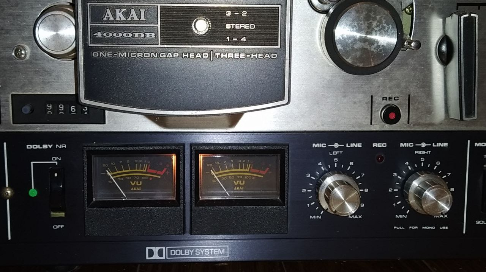

# Neural Reel Saturator

Guitar plugin made with JUCE, using black-box modelling with neural networks to reproduce the pre-amp section of my old Akai 4000DB reel-to-reel tape machine.

Machine learning is used to train a model of the left (or mono) channel gain knob, using conditioned parameters for an accurate representation of the amplified tone in different configurations. 

<p align=center>
  <picture>
    
  </picture>
</p>

The training was made using the [GuitarML](https://github.com/GuitarML/Automated-GuitarAmpModelling) Automated Amp Modelling submodule with a multi-parameterization model. This repository is an implementation of the paper ["Real-Time Guitar Amplifier Emulation with Deep Learning"](https://www.mdpi.com/2076-3417/10/3/766/htm). Real-time processing within the plugin was achieved using [RTNeural](https://github.com/jatinchowdhury18/RTNeural), which is an inference engine highly optimized for audio applications.

Taking inspiration from Neural DSP products, the goal of the project is to develop a basic machine learning plugin in a similar fashion, to model a highly non-linear amplification circuit.

# How To Use

For the training data, a 3-minute long audio of my clean guitar was recorded. The audio was passed through the device at five steps for the full range of the gain knob (0.0, 0.25, 0.50, 0.75, 1.0), resulting in five different output samples of 3 minutes each. It is important to rename every file with the correct parameter configuration in hundredths at the end (e.g. 0.0 -> `audio-000.wav`, 0.25 -> `audio-025.wav`, etc.). Open the `Models/Parameterization-Config.json` to have a better understanding of the correct filenames. The training model is an LSTM layer followed by a dense layer. 

Note: the training data needs to be in the WAV file format (FP32 WAV for best results).

## Pre-processing

Prerequisites:
- Python==3.8.7

Cloning the repository:
```
git clone https://github.com/EnrcDamn/Neural-ReelSaturator.git
cd ./Neural-ReelSaturator
```
Move the audio files into a new `Data/` folder. Run this command to create the folder:

```
mkdir Data/
```
Install the dependencies and process the data to split it into `train` and `test` sets:

```
pip install -r requirements.txt 
python data_processing.py
```

At this point, navigate to the `Automated-GuitarAmpModelling` submodule and move the processed file (you can find them in the `Data/processed/` directory) into a folder named `Recordings/`:

```
cd Automated-GuitarAmpModelling
mkdir Recordings/
```

## Training