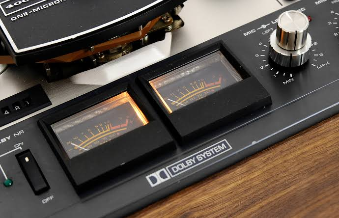

# Neural Amp guitar plugin — Akai 4000DB

Guitar plugin made with JUCE, using black-box modelling with neural networks to reproduce the pre-amp section of my old Akai 4000DB reel-to-reel tape machine.

Machine learning is used to train a model of the left (or mono) channel gain knob, using conditioned parameters for an accurate representation of the amplified tone in different configurations. 

<p align=center>
  <picture>
    
  </picture>
</p>

The training was made using the [GuitarML](https://github.com/GuitarML/Automated-GuitarAmpModelling) Automated Amp Modelling submodule with a multi-parameterization model. This repository is an implementation of the paper ["Real-Time Guitar Amplifier Emulation with Deep Learning"](https://www.mdpi.com/2076-3417/10/3/766/htm). Real-time processing within the plugin was achieved using [RTNeural](https://github.com/jatinchowdhury18/RTNeural), which is an inference engine highly optimized for audio applications.

Taking inspiration from Neural DSP products, the goal of the project is to develop a basic machine learning plugin in a similar fashion, to model a highly non-linear amplification circuit.

# How To Use

For the training data, a 3-minute long audio of my clean guitar was recorded. The audio was passed through the device at five steps for the full range of the gain knob (0.0, 0.25, 0.50, 0.75, 1.0), resulting in five different output samples of 3 minutes each. It is important to rename every file with the correct parameter configuration in hundredths at the end (e.g. 0.0 -> `audio-000.wav`, 0.25 -> `audio-025.wav`, etc.). Open the `Models/Parameterization-Config.json` to have a better understanding of the correct filenames. The training model is an LSTM layer followed by a dense layer. 

Note: the training data needs to be in mono / WAV file format (FP32 WAV for best results).

## Pre-processing

Prerequisites:
- Python==3.8.7

Cloning the repository:
```
git clone https://github.com/EnrcDamn/4000DB-NeuralAmp.git
cd ./4000DB-NeuralAmp
git submodule update --init --recursive
```
Move the audio files into a new `Data/` folder. Run this command to create the folder:

```
mkdir Data/
```
Install the dependencies and process the data to split it into `train` and `test` sets:

```
pip install -r requirements.txt 
python data_preprocessing.py
```

At this point, navigate to the `Automated-GuitarAmpModelling` submodule and move the processed file (you can find them in the `Data/processed/` directory) into a folder named `Recordings/`:

```
cd Automated-GuitarAmpModelling
mkdir Recordings/
```

## Training

To train the model, you need to replace the configs in the `./Automated-GuitarAmpModelling/Configs` with our custom parameterization json file:
```
cd ../Models
cp Parameterization-Config.json ../Automated-GuitarAmpModelling/Configs
```
At this point, it is recommended to install the `./Automated-GuitarAmpModelling/requirements.txt` dependencies in a new virtual environment (mine is working fine with Python 3.8.7):
```
cd ../Automated-GuitarAmpModelling/
pip install -r requirements.txt 
```
Preparing the data and creating the training instructions:
```
python prep_wav.py "4000DB-Parameterized" -p "./Configs/Parameterization-Config.json"
```
If latency was introduced during recording, you can specify the offset in samples of the target audio as an argument, such as `-ls 256` to shift it accordingly.

Training the model:
```
python dist_model_recnet.py -l RNN3-4000DB-Parameterized -eps 250 --seed 39 -is 2 
```
The LSTM layer needs to be configured with a hidden size of 20 (`./Automated-GuitarAmpModelling/Configs/RNN3-4000DB-Parameterized.json`). The training instructions must then be modified to included the extra inputs to the model as `-is <parameters + audio channels>`. That is, the number of inputs to the model must be the number of parameters plus the number of audio channels. In our case:
- prepared input WAVs are 2-channel: guitar input + one normalized parameter. So `-is 2` is correct.x
- targets are mono, matching the default `-os 1`.


## Build plugin

The plugin is being built through a simple CMake file, also provided by [RTNeural](https://github.com/jatinchowdhury18/RTNeural).

First, we need to add JUCE to the workspace. The easiest way is to add it as a submodule:
```
git submodule add https://github.com/juce-framework/JUCE.git JUCE
git submodule update --init --recursive
```
**Important note:** depending on the system you want to build for, you'll also need to set the VST3 format accordingly on the `./CMakeLists.txt` file. I am on Windows so I will use `set(FORMATS VST3 Standalone)`, but for example if you want to compile for macOS, use `set(FORMATS AU VST3)` instead.

```
cmake -B cmake-build
cmake --build cmake-build --config Release
```